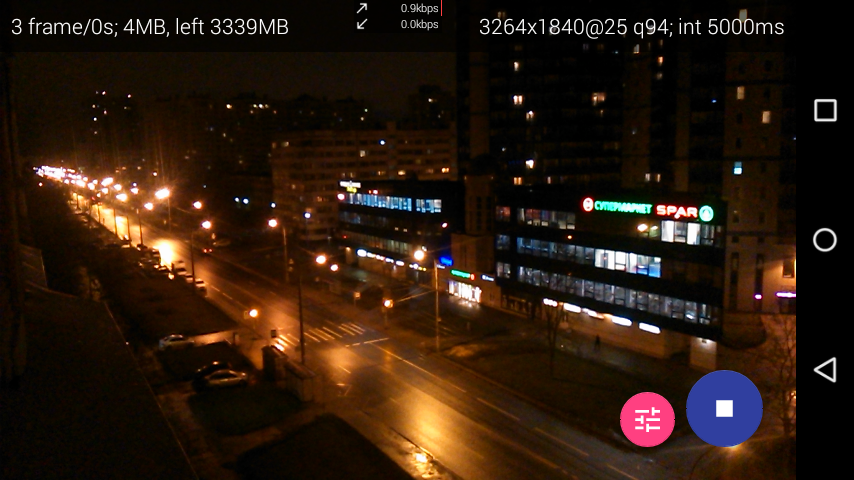
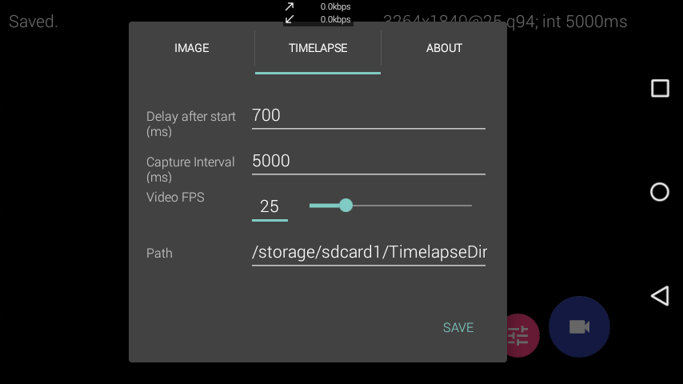

#  TimelapsePlus

This application is a branch from application "Timelapse!" (`com.explorerdc.timelapse`), which was written by the developer ExplorerDC (no specific names), but abandoned in 2011. The [last post in his blog](http://explorerdc.blogspot.ru/) was published on September 28, 2011 stating that "version 1.3 will be released soon," but there were no subsequent updates to the application.

After 6.5 years, I decided to take APK, decompile it and compile my own modification of this application.

## Screenshots

## Other details
Application make Motion JPEG encoded video, not all players able to play this format.

## Improvements from Timelapse! 1.2
* Able to choose custom path for saving videos
* <s>Android 6.0+ supports (require permissions)</s>
* Many new settings: 
	* choose path where save files
	* save mode: as video or as directory with photos
	* handler for capture: for example, add date and time to picture
	* enable flashlight
* In addition to the number of frames, during recording application also shows approximate video time (`N`s), video size (`N`MB), remaining memory space (`N`MB), video resolution (`N`x`M`px@`P`fpx), etc.
* Auto focus by clicking on preview
* A Little Material Design :)

## Requirements
For launching application need phone/tablet on Android 4.1 or higher (SDK16 or higher).
